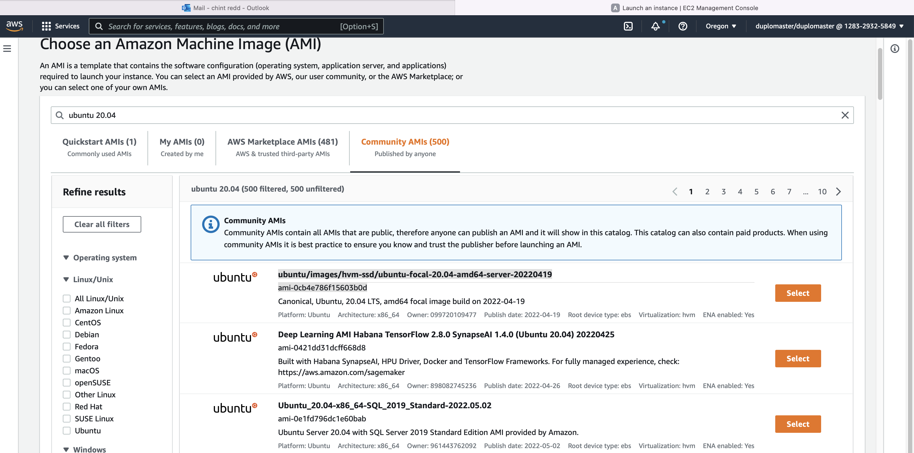
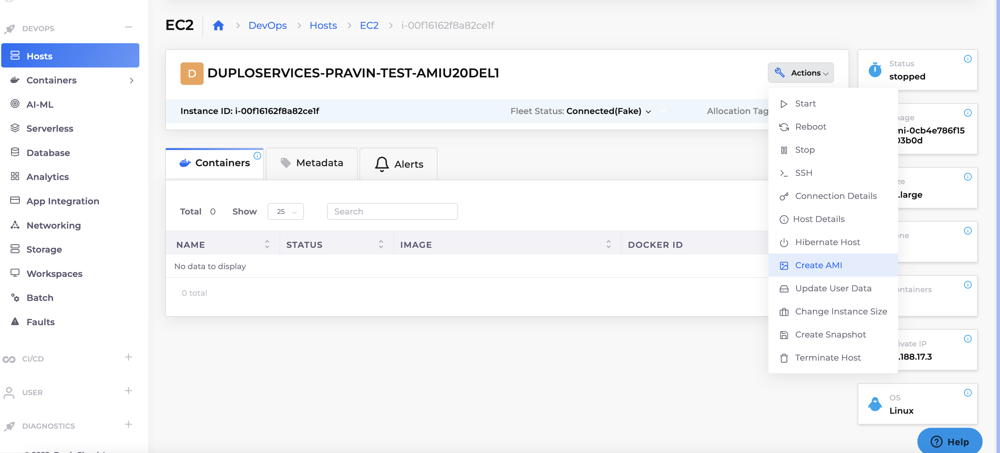

## Steps to create DUPLO AMI for- Centos-7/8, Amazon linux 2.

### Choose base AMI-ID (and base OS).
* Create AMI-ID with preferred OS.
* E.g. You may get an AMI-ID from AWS console.  Or Use an image baked in-house.



###  Create VM with Duplo Agent installed. 
* Use below 'base64 user data'. This will install Duplo native agent.


* Base64 user data.
``` 
IyEvYmluL2Jhc2gKCmN1cmwgLUggIkFjY2VwdDogYXBwbGljYXRpb24vdm5kLmdpdGh1Yi52My5yYXciIC1PIC1MIGh0dHBzOi8vYXBpLmdpdGh1Yi5jb20vcmVwb3MvZHVwbG9jbG91ZC9saW51eGFnZW50L2NvbnRlbnRzL0FnZW50QW1hem9uTGludXgyL1NldHVwLnNoCmNobW9kICt4IC4vU2V0dXAuc2gKc3VkbyBiYXNoIC4vU2V0dXAuc2gKIwo
```

* Or if you already have a script, you may include following script into your 'base64 user data'. 
* Or alternately run the following script manually on the VM.

```
#!/bin/bash

curl -H "Accept: application/vnd.github.v3.raw" -O -L https://api.github.com/repos/duplocloud/linuxagent/contents/AgentAmazonLinux2/Setup.sh
chmod +x ./Setup.sh
sudo bash ./Setup.sh
#
```


###  Create an AMI for the new VM.
* Create an AMI using either AWS console or duplo-ui.


###  Add AMI/image entry into Plan images.
* Create new plan/image entry. The AMI will be available to select during hosts creation.


###  Choose AMI during host creation
* The image congigured in plan will be available to all the related tenants.

