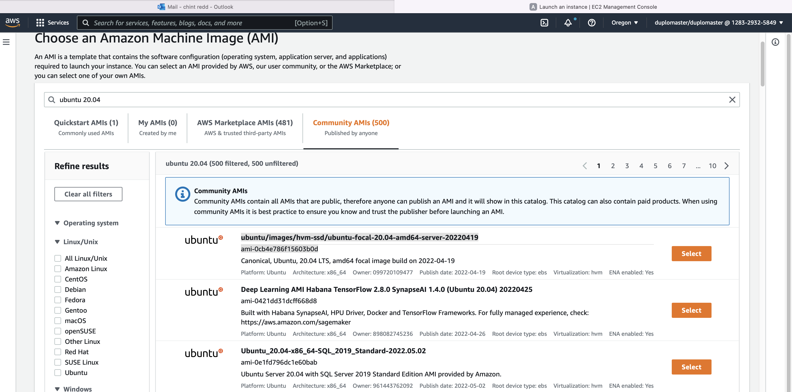
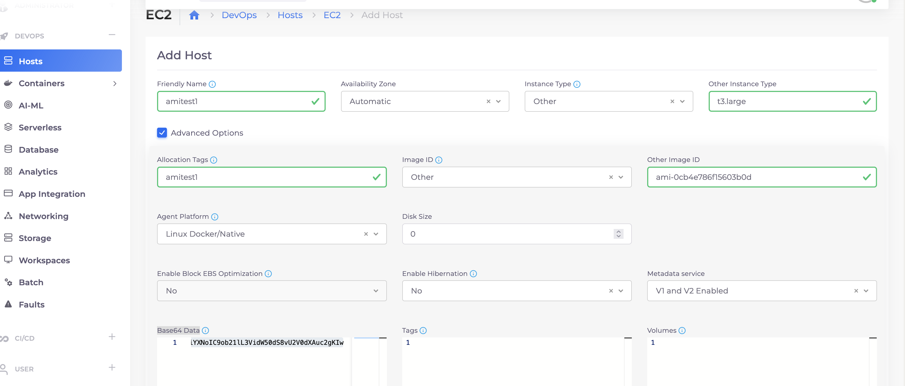
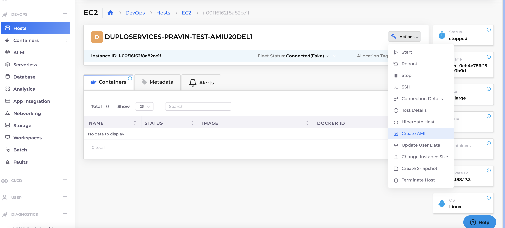
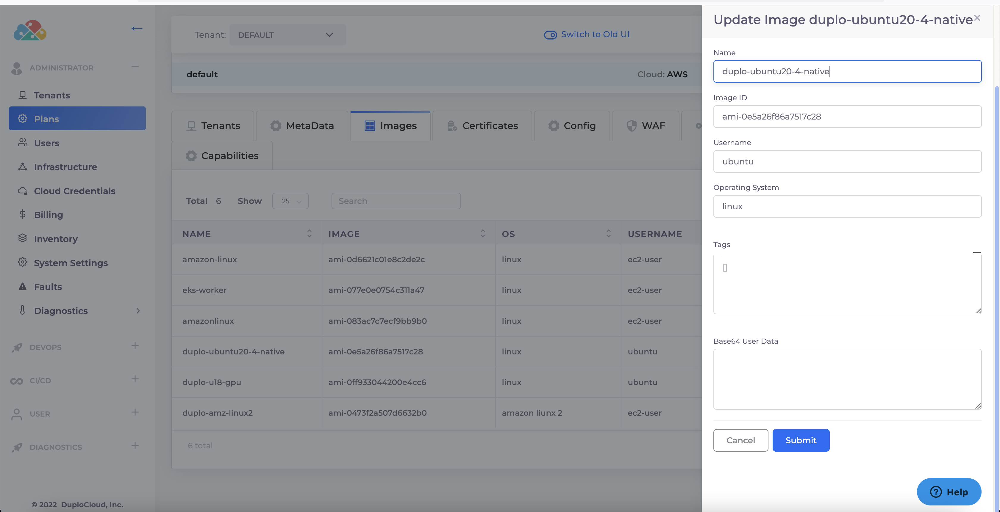
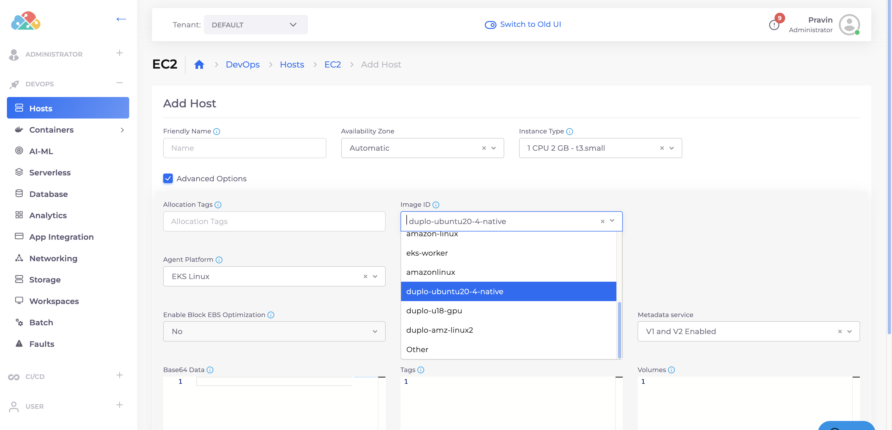

## DUPLO AMI with   ubuntu 22.04  or 20.04 

###  Select AMI form Amazon Console for ubuntu 22.04  or 20.04 




###  create host with userdata base64
* base64
``` 
IyEvYmluL2Jhc2gKCmN1cmwgLUggIkFjY2VwdDogYXBwbGljYXRpb24vdm5kLmdpdGh1Yi52My5yYXciIC1PIC0tb3V0cHV0LWRpciAvaG9tZS91YnVudHUvIC1MICBodHRwczovL2FwaS5naXRodWIuY29tL3JlcG9zL2R1cGxvY2xvdWQvbGludXhhZ2VudC9jb250ZW50cy9BZ2VudFVidW50dTIyL1NldHVwLnNoCmNobW9kICt4IC9ob21lL3VidW50dS8vU2V0dXAuc2gKc3VkbyBiYXNoIC9ob21lL3VidW50dS8vU2V0dXAuc2gKIw==
```
* script
```
#!/bin/bash

curl -H "Accept: application/vnd.github.v3.raw" -O --output-dir /home/ubuntu/ -L  https://api.github.com/repos/duplocloud/linuxagent/contents/AgentUbuntu22/Setup.sh
chmod +x /home/ubuntu//Setup.sh
sudo bash /home/ubuntu//Setup.sh
#
```



###  create AMI 


###  Add image entry into Plan    


###  Choose AMI during host creation   
 

